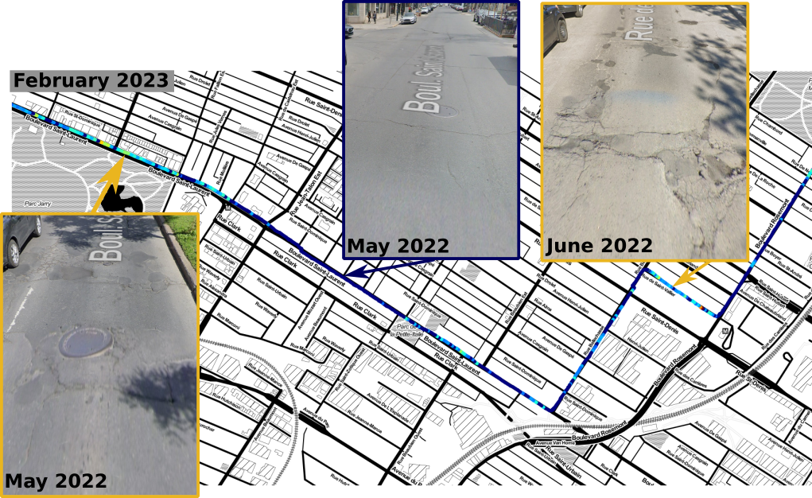

# roadqa_imu
road quality assessment using an IMU device

## Goal
The goal of this project is show the potential to measure road quality using a simple IMU device.

The figure 1 depicts a driving path in dark blue. The driving path turn respectively to green, yellow and red as the road quality get worst. For comparison, three segments are compared with the google view result. The date of acquisition are indicated on the road quality map and each google view images.


**Figure 1** : Road quality map

More details of this project are available on my hackaday [page](https://hackaday.io/project/189631-road-quality-assessment-with-imu-device).

## Measuring device
This section contains all the required information to build the measuring device.

### Bill of material (BOM)
- Arduino Uno
- Duinopeak NEO-6M GPS Shield with External Antenna and MicroSD Interface
- IMU (MPU9255 + BMP280)
- Red Led
- Green Led
- 2 resistor 220 Ohm
- Button
- SD card
- External battery (with USB connection)

### Assembly
Figure 2 below depicts a picture of the assembly of the measuring device.

**Figure 2** : Schema of the measuring device assembly

- Connect the Arduino to an external battery using the USB port.
- If there is an error during the initialization the red Led will light up.
    - SD card not detected
    - Initialisation of MPU failed
- When ready to save press the saved button.
- Green light should turn on.
- Start driving to record data (green light should stay on).
- Press the button at the end of the driving session (the green light should turn off).
- Data will get saved on the SD as `DATA_##.txt` where `##` get incremented based on the existing file on the SD cards.

## Arduino
The `.ino` file can be found in the `arduino` folder.

### Arduino library dependency
All the libraries below can be found in the library manager of Arduino except MPU9255.
- ezButton
- NeoGPS
- NeoSWSerial
- SD
- [MPU9255](https://github.com/Bill2462/MPU9255-Arduino-Library)

## CAD
CAD file for the holder used to hold the IMU device in the cup holder. 

## Process data
Once you have saved `DATA_##.txt` files you can process those using this python package.

The package was only tested on Ubuntu22.04 using python 3.8.

### Installation
You can install the package using the command:
```
$ pip install . 
```

Then run the entry point with the path to your captured data as an argument:
```
roadqa_process <path-to-data>
```

There is a sample data file available `sample` folder. Using the default value you should get the same map as depicted in figure 1.
