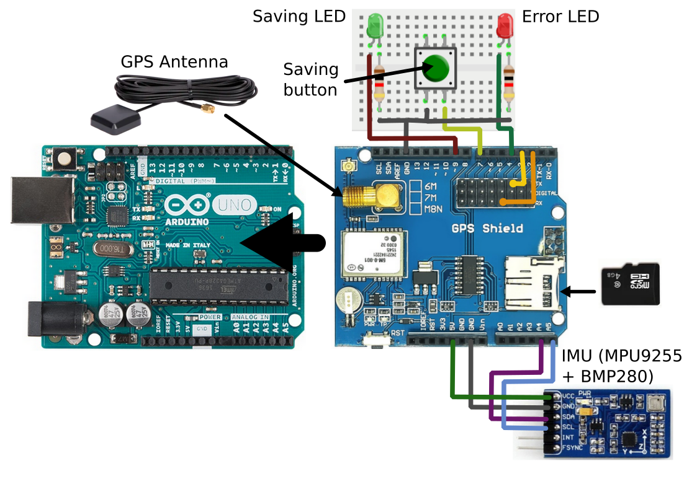

# roadqa_imu
road quality assessment using an IMU device 

## Measuring device
This section contains all the required informations to build the measuring device. 

### Bill of material (BOM)
- Arduino Uno
- Duinopeak NEO-6M GPS Shield with External Antenna and MicroSD Interface
- IMU (MPU9255 + BMP280)
- Red Led
- Green Led
- 2 resistor 220 Ohm
- Button
- SD card
- External battery (with USB connection)

### Assembly 
Figure 1 below depict a picture of the assembly of the measuring device. 

**Figure 1** : Schema of the measuring device assembly

- Connect the arduino to an external battery using the USB port
- If there is an error during the initialisation the red Led with light up 
    - SD card not detected
    - Initialisation of MPU failed
- When ready to save press the saved button
- Green light should turn on
- Start driving to record data (green light should stay on)
- Press button at the end of the driving session (green light should turn off)

## Arduino
The `.ino` file can be find in the `arduino` folder. 

### Arduino library dependancy
All the library below can be found in the library manager of arduino except MPU9255
- ezButton
- NeoGPS
- NeoSWSerial
- SD
- [MPU9255](https://github.com/Bill2462/MPU9255-Arduino-Library)

## Process data
You can install the package with a simple 
```
$ pip install . 
```

Then you should be able to run the process entrypoint 
```
roadqa_process <path-to-data>
```

There is a sample data file available `sample` folder. 
